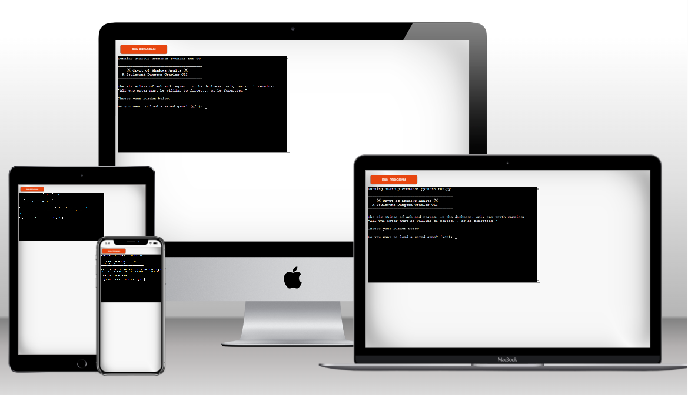

# Crypt of Shadows – A Python Dungeon Crawler CLI Game

Crypt of Shadows is a turn-based dungeon crawler built entirely in Python for the command line.  
It runs in the mock terminal on Heroku.

The player explores a cursed crypt, fights horrors from the abyss, collects relics, and faces off against a final boss — the Undead King. The game is driven by classes, functions, loops, file I/O, and a touch of dark fantasy.
It is meant to mimic 'Rogue-like' gameplay with random room generation and item collections.

[Github (repo) link to project](https://github.com/TGOSS1984/dungeon_crawler)

[Heroku Link to project](https://crypt-of-shadows-python-game-fccd0cae9fda.herokuapp.com/)

**Image from Heroku on Terminal**



---

## Table of Contents

- [Project Purpose](#project-purpose)
- [Features](#features)
- [File Structure](#file-structure)
- [Technologies Used](#technologies-used)
- [Installation VsCode](#installation-vscode)
- [Testing](#testing)
- [Development Notes](#development-notes)
- [Deployment](#deployment)
- [Credits](#credits)

---

## Project Purpose

There were two main goals in the creation of the Crypt of Shadows project: 

1) To build a command line application with the main technology being python. The aim was to include and show case some standard programming constructs such as -  flow control, iteration, selection, functions, object-oriented programming and data structures
2) To create a dungeon crawler/'rogue-like' game that is inspired by the atmospheric tension and lore-rich combat of Dark Souls and Demon’s Souls

The project aims to :

- Demonstrate Python proficiency through modular, testable, and PEP8-compliant code.
- Create an immersive user experience using branching encounters, item mechanics, and Souls-like themes.
- Provide a deployable, CLI-based game that runs in-browser via Heroku using Node.js terminal emulation.

---

##  Features

- Choose from four themed classes:
  - **Oathbound Knight** – High vitality and defence
  - **Shadow Pilgrim** – Balanced agility and attack
  - **Ashen Scholar** - Fragile but powerful spellcaster
  - **Hollow Marksman** - Ranged damage with stamina
- Turn-based battles against Souls-like enemies
- Estus Flask system (potions), gold, and rare items
- Traps, rest rooms, and random events in each dungeon room
- Save/load functionality via JSON file
- Final boss fight after surviving 10 rooms
- Colored text UI (using `colorama`) for a more immersive experience
- 'Brick' emojis used for immersion on terminal
- Defensive input validation and error handling
- Fully tested core modules (`player.py`, `enemies.py`, `battle.py`, `save_load.py`)

### How to Play

- Follow prompts to enter your name and select a class (pressing enter to proceed, picking a class from numbers 1-4)
- Navigate room by room, choose whether to fight, use estus, or flee
- If you eneter a ranom battle you select from options 1,2,3 (attack, use estus, flee)
- After each room, you’ll be asked if you want to save your progress
- The game ends when you die, defeat the boss, or manually exit (The finla boss is fought at the end once you have reached room 10)

### Features for future development

- Make more use for picked up items
- Add a shop to spend collected souls, could be added to a room randomly
- Add further classes - have more variety between them, starting item, special move etc
- Add a midway point boss, and make the boss generator random

---

##  File Structure

```
dungeon_crawler/
│
├── run.py
├── main.py
├── player.py
├── enemies.py
├── battle.py
├── dungeon.py
├── save_load.py
├── utils.py
├── index.js
├── package.json
├── requirements.txt
├── .gitignore
├── .python-version
├── Procfile
├── readme.md
├── views/
│   ├── index.html
│   └── layout.html
├── controllers/
│   └── default.js
├── data/
│   └── save.json
├── assets/
│   └── screenshots
└── tests/
    └── test_game.py
```

---

##  Technologies Used

- Python 3
- `colorama` for terminal styling
- `unittest` and `mock` for testing
- JSON for saving/loading game state
- black & autopep8 for formatting

---

##  Installation VsCode

1. Clone this repo
2. Create a virtual environment and activate it:
   ```bash
   python -m venv venv
   source venv/bin/activate  # or venv\Scripts\activate on Windows
   ```
3. Install requirements:
   ```bash
   pip install -r requirements.txt
   ```
4. Run the game:
   ```bash
   python run.py
   ```
### Running game on Heroku

This game is terminal-based, so it's not meant to be played in a web browser.

However, with code institutes mock terminal setup it can be played here [Heroku Link to project](https://crypt-of-shadows-python-game-fccd0cae9fda.herokuapp.com/)

---

##  Testing

All core features are covered in `tests/test_game.py`:

- Player stats, healing, inventory, damage
- Enemy generation and combat behavior
- Battle function tested via mocked user input
- Save/load tested using temporary file handling
- Error cases (e.g. invalid class selection, empty name input) are also tested

Run tests (in terminal) with:

```bash
python -m unittest discover tests
```
```bash
python -m unittest tests/test_game.py
```

### Tested in Python code linter

Code throughout the project has been checked and cleaned to ensure it meets **PEP8 standards**.

- **[pep8ci.herokuapp.com](https://pep8ci.herokuapp.com/#)** was used for manual checks.

- **`black`** was installed and used to auto-format the project:  
  Run `pip install black` and `black .`

Examples of some of the issues I came across using manual python code checks:

- `E501`: **Line too long**
- `E122`: **Continuation line missing indentation**
- `E302`: **Expected 2 blank lines before top-level function/class**
- `W291`: **Trailing whitespace**
- `W293`: **Blank line contains whitespace**

As black did not fully fix all of the formatting I also installed autopep8 to support with missing indentation, trailling whitespace, blank lines, expected 2 lines etc.

- **`autopep8`** was installed and used to auto-format the project:  
  Once installed, run `pip install autopep8` and `autopep8 --in-place --aggressive --aggressive --recursive .`


###  Bugs I Encountered (and fixed) & Manual Testing

Examples below of bugs I encountered and ultimately fixed. Alongside these fixes regular print statements were used to try and troubleshoot any issues as they arose.
VsCode terminal was used often as it sometimes pin pointed the file & the line where potential issues were

**Boss Appeared Randomly in Early Rooms**
Originally, the "Undead King" could spawn in regular rooms (not just the end).  
→ I fixed this by excluding the boss from the random enemy generator using a filtered list.

**Game Didn’t Resume from the Correct Room**
When I added the save feature, it saved the player stats — but restarted back at room 1.  
→ I updated the save/load functions to also store `room_count` so progress could resume properly.

**SAVE_FILE Error in Testing**
I tried to test the save function using a temp file but hit an `UnboundLocalError` with `SAVE_FILE`.  
→ Refactored `save_game()` and `load_game()` to accept a custom path — much easier to test now.

**Wrong Variable Case: `Name` not `name`**
Got a `NameError` on player creation because I accidentally capitalized `Name`.  
→ Simple typo fix in `player.py`.

**Dungeon Not Recognizing `enter_dungeon`**
Forgot to import `enter_dungeon` correctly into `main.py`, which broke the game loop.  
Added the import and that fixed it

**Battle test Issue**
When testing the battle function there was originally a finite list of mock inputs. If the battle took longer than the list of mock inputs the test would fail. The fix was to replace the finite list with an infinite iterator to simulate the player attacking every turn.

---

##  Development Notes

- Code is modular and follows PEP8
- All inputs are validated with retry loops or graceful fallbacks
- Git used for version control from day one
- Commit history is structured around logical features and fixes

---

##  Deployment

This game is CLI-based and can run in any terminal that supports Python 3.  

**VSCode**

- Code was written using VSCode
- Folder structure all main .py files found in root. Along with requirements.txt, .gitingore, .python-version. Assests folder contains screenshots for readme, tests folder contains the .py tests file. Data folder contains the .json save file.

**GitHub**

- A GitHub account was created
- A new reposiory was created on GitHub by clicking the 'New' button. It was named and set as public.
- A folder was created in VSCode and initialised as a Git repository
- In VSCode the terminal was used to run commands to link the local project to the GitHub repository
- Throughout the process of builing the website, commits & pushes were staged regularly using terminal commands such as 'git add .' , 'git-commit -m' & 'git push'
- Host the project: Went to my GitHub repository, clicked settings > pages and selected the branch to publish, hit save and then GitHub generated a live link (link at top of readme)

**Deploy to Heroku**

- Ensure entry point is run.py file
- Create a Procfile in the project root app
- Add buildpacks via Heroku dashboard, heroku/python & heroku/node/js
- Set config variable , settings > config vars > KEY:PORT VALUE:8000
- Push project to github ensuring the following files are present, run.py/requirements.txt/Procfile
- Connect GitHub repo to Heroku. In Heroku app > Deploy tab, connect repo, enable auto deploys (if required), click deploy branch
- Click 'View App' to play. Game will open in a web based terminal

---

## Credits

- Built by: [Tom Goss](https://github.com/TGOSS1984)
- ai was used to support in certain sections of readme for formatting purposes

---

